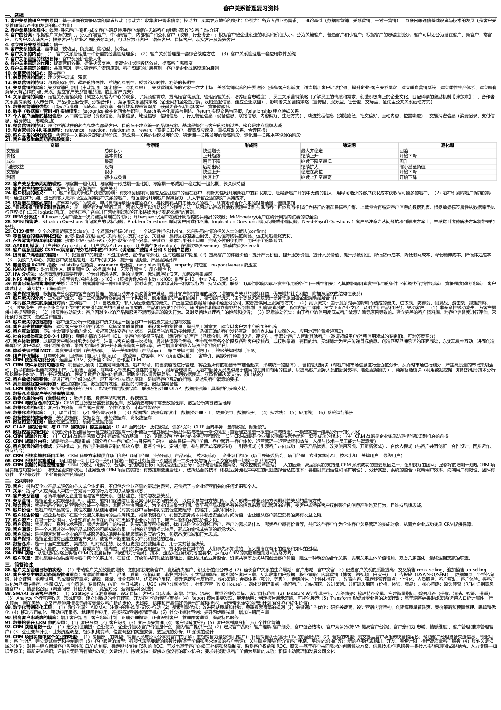

# text-to-a4

**一份复习资料，一张 A4 纸。**

将任意文档自动排版成极致紧凑的 A4 PDF，方便打印复习。中英文通用，文字不重叠。

<p align="center">
  
</p>

> 9462 字"客户关系管理"复习资料 → **1 页 A4 纸**，粗体术语 + 正文解释，打印清晰可读

## 特点

- **一张纸搞定**：自动压缩排版，尽量塞进 1 页 A4，方便随身携带
- **中英文通用**：中文、英文、中英混排，任何语言都支持
- **智能排版**：自动识别段落、问答、名词解释、表格等 10 种内容结构
- **文字不重叠**：表格布局 + 列宽限制，数字和文字绝不打架
- **直接打印**：A4 标准尺寸，微软雅黑字体，纯黑白，任何打印机都能打

## 快速开始

### 安装依赖

```bash
pip install playwright pymupdf
playwright install chromium
```

### 在 Claude Code 中使用

把本目录放到 `~/.claude/skills/text-to-a4/`，然后直接说：

```
帮我把这份资料排版成 A4 复习纸
```

Claude 会自动提取文字 → 理解结构 → 紧凑排版 → 导出 A4 PDF。

### 直接使用脚本

```bash
python scripts/extract_text.py 资料.docx -o extracted.txt
python scripts/to_html.py extracted.txt -o output.html --title "复习资料"
python scripts/to_pdf.py output.html -o 复习资料.pdf
```

## 支持的格式

| 格式 | 扩展名 |
|------|--------|
| Word 文档 | `.docx` |
| 纯文本 | `.txt` |
| Markdown | `.md` |
| PDF | `.pdf` |

## 文件结构

```
text-to-a4/
├── README.md
├── SKILL.md
├── demo.png
└── scripts/
    ├── extract_text.py
    ├── to_html.py
    └── to_pdf.py
```

## License

MIT
